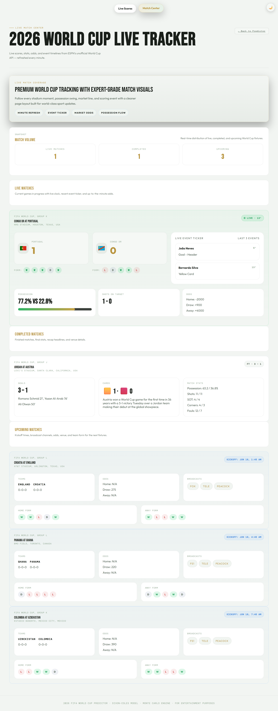
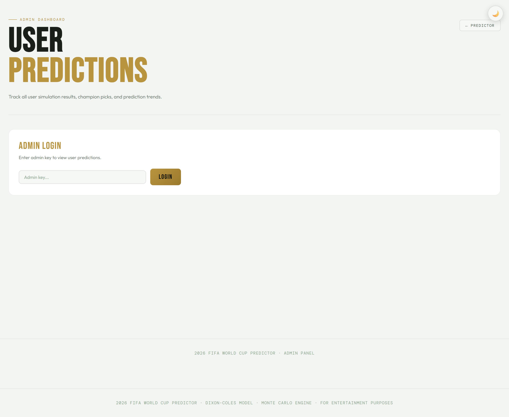
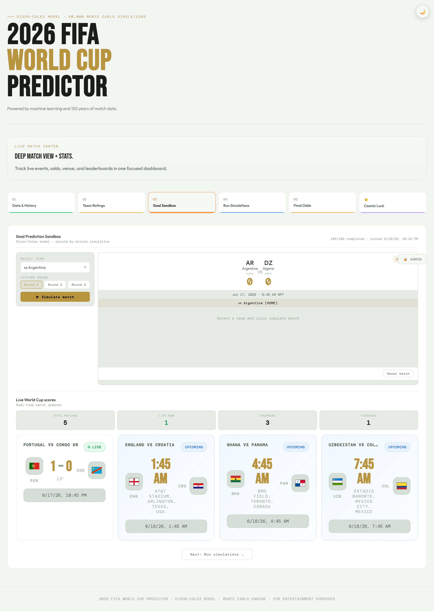
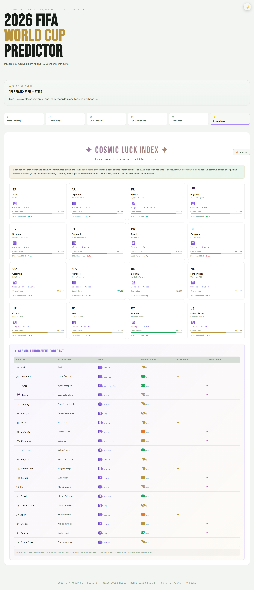
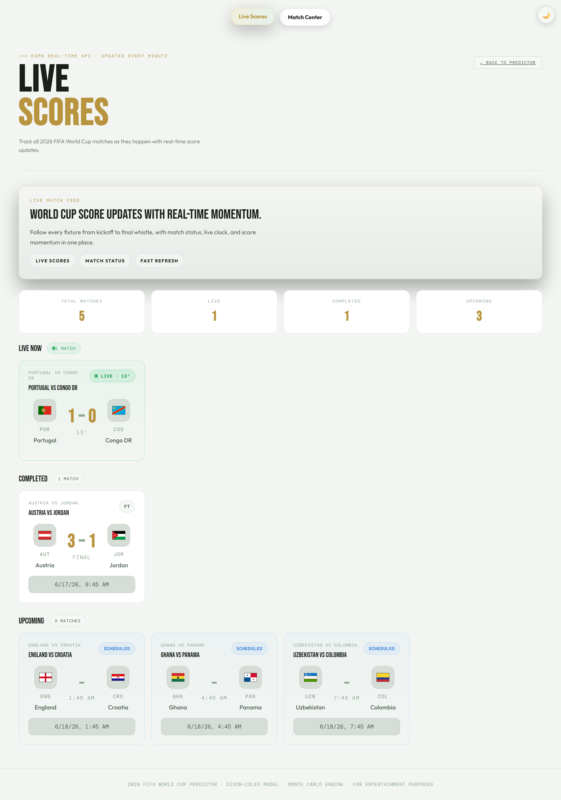

# 2026 FIFA World Cup Predictor ⚽🏆

[](https://angular.dev)
[](https://expressjs.com)
[](https://supabase.com)
[](https://netlify.com)

A full-stack web application that predicts the **2026 FIFA World Cup** using a **Dixon-Coles bivariate Poisson Monte Carlo engine**. Run 50,000 tournament simulations to compute win probabilities, track live fixtures via ESPN, explore astrological team ratings, and save your predictions.

---

## Screenshots

| Homepage | Live Match Center | Admin Dashboard |
|---|---|---|
|  |  |  |

| Sandbox Simulator | Cosmic Luck | Live Scores |
|---|---|---|
|  |  |  |

---

## Features

- **Monte Carlo Simulation** — 50,000 tournament runs using ELO-based expected goals with Dixon-Coles correlation, form adjustments, rest-day modifiers, host advantage, climate penalties, and live ELO updates
- **Live Match Tracking** — Real-time scores from ESPN API with 60-second polling, fallback to tournament data
- **Sandbox Match Simulator** — Simulate any head-to-head matchup with minute-by-minute commentary feed
- **Full Tournament Bracket** — 104 matches, 12 groups (A–L), 32 knockout teams, all dynamically generated
- **Cosmic Luck** — Astrology-based team ratings using player zodiac signs and planetary modifiers
- **Prediction Saving** — Save your top-5 champion picks with percentage probabilities
- **Admin Dashboard** — Champion pick distribution chart, user stats, sandbox stats (auth: `wc2026admin`)
- **Dark/Light Theme** — Persisted preference, respects `prefers-color-scheme`
- **Responsive Design** — 4 breakpoints (1024px → 768px → 640px → 480px)

---

## Quick Start

```bash
# Install dependencies (client + server)
npm run install:all

# Terminal 1 — API server (port 3001)
npm run server

# Terminal 2 — Angular dev server (port 4200)
npm run client

# Or both at once
npm run dev
```

Open **http://localhost:4200** — the API proxy is configured in `proxy.conf.json`.

---

## Tech Stack

| Layer | Technology |
|-------|-----------|
| **Frontend** | Angular 20, TypeScript 5.9, RxJS 7.8, Chart.js 4.5, Tailwind CSS 4 |
| **Backend** | Express.js 4.21, serverless-http 3 |
| **Storage** | Supabase (PostgreSQL JSONB) or local JSON files |
| **Hosting** | Netlify (SPA + serverless function) |
| **External APIs** | ESPN Scoreboard (`site.api.espn.com`) |

---

## Project Structure

```
├── client/                     # Angular 20 frontend
│   ├── src/app/
│   │   ├── models/             # Team, Fixture, MatchResult types
│   │   ├── pages/              # Predictor, Live, LiveMatchCenter, LiveScores, Admin
│   │   ├── services/           # Team, Fixture, Simulation, Prediction, ESPN, Astro, Theme
│   │   ├── app.ts              # Root component (theme toggle, footer)
│   │   ├── app.routes.ts       # Routing config
│   │   └── app.config.ts       # Angular providers
│   └── styles.scss             # Global design system (standardized components)
├── server/
│   └── index.js                # Express API (local dev)
├── netlify/
│   └── functions/
│       └── api.js              # Serverless API (production, with Supabase)
├── data/                       # JSON file storage
│   ├── teams-metadata.json     # 48 team profiles with ELO, flags, groups
│   ├── opening-fixtures.json   # 24 opening group stage matches
│   ├── fixture-results.json    # Synced match scores
│   ├── predictions.json        # User predictions
│   ├── recent-matches.json     # Form calculation data
│   └── sandbox-sims.json       # Sandbox sim log
├── supabase/
│   └── init.sql                # Supabase table migration
└── netlify.toml                # Netlify build/deploy config
```

---

## API Endpoints

| Method | Path | Auth | Description |
|--------|------|------|-------------|
| GET | `/api/teams` | — | Cached team list with ELO ratings |
| POST | `/api/teams/sync` | — | Perturb 3–5 random team ELOs |
| GET | `/api/recent-matches` | — | Match history for form calculation |
| GET | `/api/fixtures/status` | — | Full fixture status + 104-match bracket |
| POST | `/api/fixtures/sync` | — | Simulate next 2 unfinished matches |
| GET | `/api/espn-scores` | — | Proxy to ESPN live scoreboard |
| POST | `/api/predictions` | — | Save a user prediction |
| POST | `/api/sandbox-sims` | — | Log a sandbox simulation |
| GET | `/api/admin/predictions` | `X-Admin-Key` | All user predictions |
| GET | `/api/admin/stats` | `X-Admin-Key` | Aggregated chart data |
| POST | `/api/admin/fixtures/result` | — | Manually set a match score |

---

## Simulation Engine

The core algorithm in `SimulationService` implements the **Dixon-Coles bivariate Poisson model**:

```
P(X=x, Y=y) = τ(x, y) × Poisson(x; λA) × Poisson(y; λB)
```

**Expected goals per match:**
```
λ = 1.30 × exp(ELO_diff / 600)    — Group stage
λ = 1.08 × exp(ELO_diff / 600)    — Knockouts
```

**Adjustments:**
- Recent form (±25 ELO, weighted by recency)
- Rest days (+8 ELO per extra day, max +24)
- Host advantage (+75 ELO)
- Climate penalty (−15 ELO for cold/temperate teams)
- Extra-time goals at 38% of base λ
- Penalties via Bernoulli process using team `penRate`

**ELO updates:** K=40 (group), K=60 (knockout), live within each simulation.

---

## Deployment

### Netlify

The app deploys as a static SPA with a serverless function. The `netlify.toml` routes `/api/*` to the function and `/*` to `index.html`.

**Environment variables (required for Supabase storage):**
- `SUPABASE_URL`
- `SUPABASE_SERVICE_ROLE_KEY`
- `ADMIN_KEY` (optional, default: `wc2026admin`)

### Supabase

Run `supabase/init.sql` to create the `app_store` table (key-value JSONB storage). Falls back to local JSON files when Supabase isn't configured.

---

## License

For entertainment purposes. Not affiliated with FIFA.
