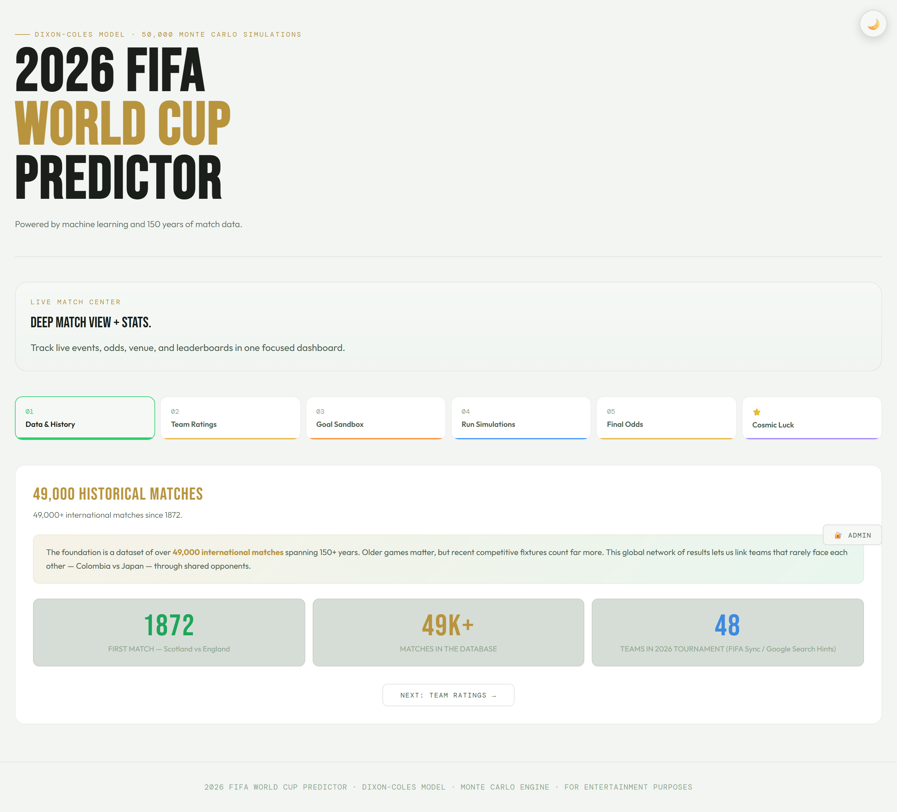
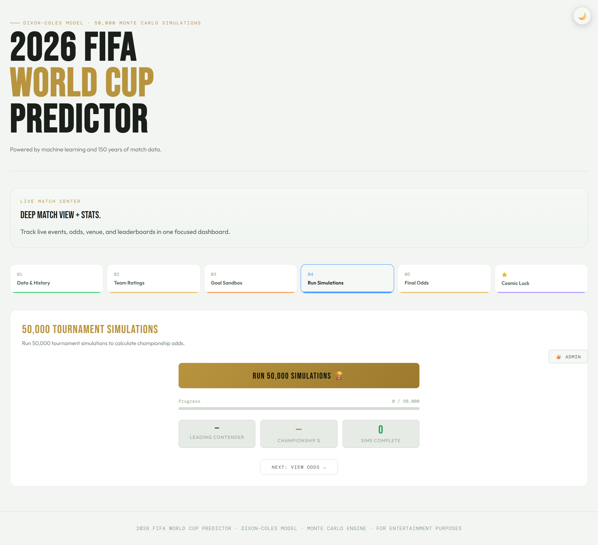

# 2026 FIFA World Cup Predictor — Project Report

> **Version:** 1.0.0  
> **Stack:** Angular 20 + Express.js + Supabase + Netlify  
> **Repository:** [github.com/RahimGopali1/predictor](https://github.com/RahimGopali1/predictor)  
> **Last Updated:** June 17, 2026

---

## Table of Contents

1. [Screenshots](#screenshots)
2. [Project Overview](#1-project-overview)
3. [Architecture](#2-architecture)
4. [Frontend (Angular 20)](#3-frontend-angular-20)
5. [Backend (Express.js API)](#4-backend-expressjs-api)
6. [Data Models](#5-data-models)
7. [Monte Carlo Simulation Engine](#6-monte-carlo-simulation-engine)
8. [Tournament Bracket Logic](#7-tournament-bracket-logic)
9. [Key Features & Walkthrough](#8-key-features--walkthrough)
10. [Deployment](#9-deployment)
11. [Future Ideas & Improvements](#10-future-ideas--improvements)

---

## Screenshots

### Homepage — 6-Step Predictor

*The main predictor page with 6 clickable step cards, header, and footer.*

### Data & History Panel

*Panel 1: Sync status, team count, match count, and data info.*

### Sandbox Match Simulator

*Panel 3: Pick two teams and simulate a match with live commentary feed.*

### Full Tournament Simulator

*Panel 4: Run 50,000 Monte Carlo simulations with progress tracking and results table.*

### Cosmic Luck

*Panel 6: Zodiac-based team analysis with luck bars and fortune forecast table.*

### Live Match Center

*Live, completed, and upcoming match cards with status pills and team scores.*

### Live Scores

*Overview stat cards and expanded match cards with form badges.*

### Admin Dashboard

*Champion pick bar chart, stats, and recent predictions list.*

---

## 1. Project Overview

The **2026 FIFA World Cup Predictor** is a full-stack web application that simulates the 2026 FIFA World Cup using a sophisticated Monte Carlo engine based on the **Dixon-Coles bivariate Poisson model**. It allows users to:

- View real-time fixture tracking across all 104 matches
- Run 50,000+ tournament simulations to compute win probabilities
- Simulate individual matchups in a sandbox environment
- Track live scores via ESPN integration
- Explore astrological "cosmic luck" ratings for teams
- Save predictions with leaderboard-style top-5 picks
- Administer match results through an admin dashboard

The app features a dark/light theme, fully responsive design, and is deployed on Netlify with the API running as a serverless function.

---

## 2. Architecture

```
┌─────────────────────────────────────────────────────────────┐
│                   Netlify Hosting                           │
│                                                             │
│  ┌─────────────────────┐    ┌──────────────────────────┐   │
│  │  Angular 20 SPA     │    │  Netlify Function (API)   │   │
│  │  (client/dist)      │◄──►│  Express.js Serverless   │   │
│  │  Port: 4200 (dev)   │    │  Port: 3001 (dev)        │   │
│  └─────────┬───────────┘    └──────────┬────────────────┘   │
│            │                            │                    │
│            ▼                            ▼                    │
│  ┌─────────────────┐      ┌──────────────────────────┐      │
│  │ /fixture-       │      │  Supabase (Production)   │      │
│  │ status.json     │      │  OR data/ JSON files     │      │
│  │ (fallback)      │      │  (Local Dev)             │      │
│  └─────────────────┘      └──────────────────────────┘      │
│                                                             │
│  ┌──────────────────────────────────────────┐               │
│  │  External APIs                            │               │
│  │  • ESPN Scoreboard (site.api.espn.com)    │               │
│  │  • FIFA Rankings (via sync endpoint)      │               │
│  └──────────────────────────────────────────┘               │
└─────────────────────────────────────────────────────────────┘
```

### Directory Structure

```
├── client/                     # Angular 20 frontend
│   ├── src/
│   │   ├── app/
│   │   │   ├── models/         # TypeScript interfaces
│   │   │   ├── pages/          # Route components
│   │   │   ├── services/       # Injectable services
│   │   │   ├── app.ts          # Root component
│   │   │   ├── app.config.ts   # Angular app config
│   │   │   └── app.routes.ts   # Routing definitions
│   │   ├── styles.scss         # Global styles (design system)
│   │   ├── tailwind.css        # Tailwind directives
│   │   └── index.html          # Entry HTML
│   ├── tailwind.config.js
│   └── package.json
├── server/                     # Express.js API
│   ├── index.js                # Main server (local dev)
│   └── package.json
├── netlify/
│   └── functions/
│       └── api.js              # Serverless API (production)
├── data/                       # JSON file storage
│   ├── teams-metadata.json     # 48 team profiles
│   ├── teams-cache.json        # Cached team data
│   ├── opening-fixtures.json   # 24 opening MD1 matches
│   ├── fixture-results.json    # Synced match results
│   ├── predictions.json        # User predictions store
│   ├── recent-matches.json     # Recent match history
│   └── sandbox-sims.json       # Sandbox simulations log
├── supabase/
│   └── init.sql                # Supabase migration script
├── netlify.toml                # Netlify deployment config
├── package.json                # Root workspace scripts
└── TODO.md                     # Development notes
```

---

## 3. Frontend (Angular 20)

### 3.1 Technology Stack

| Technology | Version | Purpose |
|------------|---------|---------|
| Angular | 20.3 | Core framework |
| TypeScript | 5.9 | Type-safe JavaScript |
| RxJS | 7.8 | Reactive data streams |
| Chart.js | 4.5 | Admin dashboard charts |
| Tailwind CSS | 4.3 | Utility-first CSS |
| PostCSS | 8.5 | CSS processing |

### 3.2 Routing

Defined in `client/src/app/app.routes.ts`:

| Path | Component | Description |
|------|-----------|-------------|
| `/` | `PredictorComponent` | Main predictor with 6-step panel interface |
| `/live` | `LiveComponent` (parent) | Live matches layout with tabs |
| `/live/match` | `LiveMatchCenterComponent` | Full match center with hero, match cards |
| `/live/match/:id` | `LiveMatchCenterComponent` | Specific match detail |
| `/live/scores` | `LiveScoresComponent` | Live scores dashboard |
| `/admin` | `AdminComponent` | Admin panel (stats, charts, match control) |
| `**` | — | Catch-all, redirects to `/` |

### 3.3 Components

#### Predictor Component (`predictor/`)
The main page. Contains a 6-step navigation panel:
1. **Data & History** — Stats dashboard (teams, matches, sync data)
2. **World Cup Teams** — Searchable table of all 48 teams with ELO rankings
3. **Sandbox Match Simulator** — Pick two teams and simulate a single match
4. **Full Tournament Sim** — Run 50,000 Monte Carlo simulations
5. **Your Prediction** — View results and save predictions
6. **Cosmic Luck** — Astrology-based team ratings

#### Live Match Center (`live-match-center/`)
- Hero section with tournament overview
- Three sections: Live Now, Completed, Upcoming
- ESPN color-coded status pills (green for live, blue for upcoming)
- Match cards with team flags, scores, venue info

#### Live Scores (`live-scores/`)
- Overview stat cards (finished matches, groups)
- Expanded match cards with score display
- Team form badges (W/D/L)

#### Live Component (`live/`)
- Tab navigation container (Match Center / Scores)
- Sticky tab bar with responsive wrapping

#### Admin Component (`admin/`)
- Admin key authentication (default: `wc2026admin`)
- Champion pick bar chart (Chart.js)
- Champion pick table with percentages
- Sandbox simulation stats
- Recent predictions list

### 3.4 Services

| Service | File | Responsibility |
|---------|------|----------------|
| `TeamService` | `team.service.ts` | Load/sync team data, recent matches |
| `FixtureService` | `fixture.service.ts` | Load fixture status, get next matches |
| `SimulationService` | `simulation.service.ts` | Monte Carlo engine, tournament runner |
| `PredictionService` | `prediction.service.ts` | Save/load predictions, admin stats |
| `EspnMatchService` | `espn-match.service.ts` | ESPN scoreboard polling + local fallback |
| `AstroService` | `astro.service.ts` | Zodiac/planetary calculations |
| `ThemeService` | `theme.service.ts` | Dark/light theme toggle |

### 3.5 Models

#### Team Model (`models/team.model.ts`)
```typescript
interface Team {
  id: string;        // e.g., "ARG"
  name: string;      // e.g., "Argentina"
  flag: string;      // Emoji flag
  group: string;     // Group A-L
  elo: number;       // ELO rating (1500-2150)
  fifaRank: number;  // FIFA world ranking
  star: string;      // Star player name
  starDOB: string;   // Star player DOB (for astrology)
  value: string;     // Squad market value
  penRate: number;   // Penalty shootout skill
  host: boolean;     // Host nation (US, Mexico, Canada)
  climate: string;   // Home climate (temperate, tropical, arid, cold, varied)
}

interface SimResult {
  team: Team;
  r32: number;   // % reaching Round of 32
  r16: number;   // % reaching Round of 16
  qf: number;    // % reaching Quarter-Finals
  sf: number;    // % reaching Semi-Finals
  fin: number;   // % reaching Final
  champ: number; // % winning tournament
}
```

#### Fixture Model (`models/fixture.model.ts`)
```typescript
interface TournamentFixture {
  id: number;
  stage: string;      // "Group", "Round of 32", etc.
  matchday?: number;  // 1, 2, or 3 for group stage
  date: string;
  time: string;
  group?: string;
  home: string;       // Team ID
  away: string;       // Team ID
  venue: string;
  city: string;
  homeScore?: number | null;
  awayScore?: number | null;
  status: string;     // "Scheduled", "Finished"
  finished: boolean;
}

interface FixtureStatus {
  teamStatus: Record<string, { status: string; stage: string }>;
  nextMatches: Record<string, TeamNextMatch>;
  champion: string | null;
  groupStageComplete: boolean;
  finishedMatches: number;
  totalMatches: number;
  allFixtures: TournamentFixture[];
}
```

### 3.6 Design System

The app uses a custom design system defined in `client/src/styles.scss`:

- **Dark/Light themes** via CSS custom properties on `[data-theme="dark"]` / `[data-theme="light"]`
- **CSS Variables** for colors, fonts, border-radius, gradients
- **Standardized components**: hero cards, match cards, status pills, stat cards, section blocks, tabs, team avatars, score displays, form badges, empty states, live tabs
- **Responsive breakpoints**: 1024px (tablet landscape), 768px (tablet), 640px (large phone), 480px (small phone)
- **Typography**: Bebas Neue (headings), Outfit (body), DM Mono (monospace)
- **Animation**: Fade-up transitions for panels, pulse animation for live indicators, slide-in for commentary events

---

## 4. Backend (Express.js API)

### 4.1 Local Server (`server/index.js`)

Standalone Express server that:
- Reads/writes data from `data/` JSON files
- Serves on port 3001 (configurable via `PORT`)
- Uses in-memory file operations with `readJson`/`writeJson` helpers

### 4.2 Serverless Function (`netlify/functions/api.js`)

Production version that:
- Wraps Express via `serverless-http`
- Supports **Supabase** for durable storage (when `SUPABASE_URL` and `SUPABASE_SERVICE_ROLE_KEY` are set)
- Falls back to local JSON files when Supabase is not configured
- Normalizes `/api/` route prefix for Netlify function routing

### 4.3 API Endpoints

| Method | Endpoint | Auth | Description |
|--------|----------|------|-------------|
| GET | `/api/teams` | — | Returns cached team list with ELO ratings |
| POST | `/api/teams/sync` | — | Perturbs 3-5 random team ELOs (+/- 15) |
| GET | `/api/recent-matches` | — | Recent match history for form calculation |
| GET | `/api/fixtures/status` | — | Full fixture status + 104-match tournament tree |
| POST | `/api/fixtures/sync` | — | Simulates next 2 unfinished matches |
| POST | `/api/admin/fixtures/result` | Admin | Manually set a match result |
| GET | `/api/espn-scores` | — | Proxies ESPN live scoreboard |
| POST | `/api/predictions` | — | Saves a user prediction |
| POST | `/api/sandbox-sims` | — | Logs a sandbox simulation |
| GET | `/api/admin/predictions` | Admin | All user predictions |
| GET | `/api/admin/stats` | Admin | Aggregated stats for charts |

**Admin authentication**: `X-Admin-Key` header. Default key: `wc2026admin`.

### 4.4 Data Storage Strategy

```
┌───────────────────────────────────────┐
│           Storage Layer               │
│                                       │
│  ┌─────────────┐   ┌──────────────┐  │
│  │  Supabase    │   │  JSON Files  │  │
│  │  (Netlify)   │   │  (Local Dev) │  │
│  │              │   │              │  │
│  │  app_store   │   │  data/       │  │
│  │  ┌────────┐  │   │  ├─predictions.json│
│  │  │key     │  │   │  ├─fixture-  │  │
│  │  │value   │  │   │  │  results.json │
│  │  │updated_│  │   │  ├─sandbox-  │  │
│  │  │at      │  │   │  │  sims.json│  │
│  │  └────────┘  │   │  └─teams-   │  │
│  └─────────────┘   │    cache.json│  │
│                    └──────────────┘  │
└───────────────────────────────────────┘
```

The `readJsonData(key, filePath)` function abstracts this — Supabase `app_store` table (key-value with JSONB) when available, local file otherwise.

---

## 5. Data Models

### 5.1 Teams (48 qualified nations)

Spread across 12 groups (A-L) of 4 teams each. Includes 3 host nations (USA, Mexico, Canada).

**Top 10 by ELO Rating:**

| Rank | Team | ELO | Group | Star Player |
|------|------|-----|-------|-------------|
| 1 | Argentina 🇦🇷 | 2140 | J | Julián Álvarez |
| 2 | France 🇫🇷 | 2090 | I | Kylian Mbappé |
| 3 | Spain 🇪🇸 | 2065 | H | Rodri |
| 4 | Brazil 🇧🇷 | 2030 | C | Vinícius Jr. |
| 5 | England 🏴󠁧󠁢󠁥󠁮󠁧󠁿 | 2020 | L | Jude Bellingham |
| 6 | Portugal 🇵🇹 | 2010 | K | Bruno Fernandes |
| 7 | Colombia 🇨🇴 | 1985 | K | Luis Díaz |
| 8 | Netherlands 🇳🇱 | 1980 | F | Virgil van Dijk |
| 9 | Uruguay 🇺🇾 | 1970 | H | Federico Valverde |
| 10 | Germany 🇩🇪 | 1960 | E | Florian Wirtz |

### 5.2 Tournament Schedule (104 matches)

| Stage | Match IDs | Matches | Format |
|-------|-----------|---------|--------|
| Group Stage (MD1) | 1–24 | 24 | 12 groups × 2 matches |
| Group Stage (MD2) | 25–48 | 24 | Generated dynamically |
| Group Stage (MD3) | 49–72 | 24 | Generated dynamically |
| Round of 32 | 73–88 | 16 | KO pairings from standings |
| Round of 16 | 89–96 | 8 | Winners of R32 |
| Quarter-Finals | 97–100 | 4 | Winners of R16 |
| Semi-Finals | 101–102 | 2 | Winners of QF |
| Third Place | 103 | 1 | Losers of SF |
| Grand Final | 104 | 1 | Winners of SF |

### 5.3 Fixture Results Storage

Stored as `fixture-results.json` (or Supabase), keyed by match ID:
```json
{
  "1": { "homeScore": 2, "awayScore": 1, "winner": "KOR" },
  "_syncedAt": "2026-06-17T15:26:35.423Z"
}
```

---

## 6. Monte Carlo Simulation Engine

The core of the predictor lives in `SimulationService` (client-side) and is replicated in the server for fixture sync.

### 6.1 Dixon-Coles Bivariate Poisson Model

The engine uses a **bivariate Poisson distribution with a Dixon-Coles correction** for low-scoring football matches:

```
P(X=x, Y=y) = τ(x, y) × Poisson(x; λA) × Poisson(y; λB)
```

Where:
- **λA**, **λB** = Expected goals for each team
- **τ(x, y)** = Dixon-Coles correction (accounts for correlation at low scores)

### 6.2 Expected Goals Calculation

```python
λ = BASE × exp(ELO_diff / 600)

Where:
- BASE = 1.30 (group stage) or 1.08 (knockouts)
- ELO_diff = Team A ELO - Team B ELO
```

### 6.3 Adjustments Applied

| Factor | ELO Impact | Description |
|--------|-----------|-------------|
| **Recent form** | +/- 25 max | Weighted by recency (k/60) and match importance (rec) |
| **Rest days** | +8/extra day, max +24 | More rest = better performance |
| **Host advantage** | +75 ELO | Home nation boost |
| **Climate penalty** | -15 ELO | Cold/temperate teams penalized |
| **ELO convergence** | 88% weight | If gap < 80 ELO, regress toward mean |

### 6.4 Knockout Adjustments

- Extra goals boost: +Poisson(0.25) to the winner in KO matches
- Extra time: ET goals sampled at 38% of base λ
- Penalties: Based on team `penRate` (Bernoulli process)

### 6.5 ELO Update

After each match:
```
new_ELO = ELO + K × (actual_result - expected_result)
```
- K = 40 (group stage), K = 60 (knockouts)
- Ratings are **live** within each simulation (not carried between simulations)

### 6.6 Simulation Pipeline

```
For each of 50,000 simulations:

  1. Round-robin group stage (3 matchdays)
     → Calculate standings (pts → GD → GF → ELO)
  
  2. Take top 2 from each group + best 8 third-placed teams
     → Backtracking algorithm pairs third-placed teams to group winners
  
  3. Round of 32 (16 KO matches)
  4. Round of 16 (8 KO matches)
  5. Quarter-Finals (4 KO matches)
  6. Semi-Finals (2 KO matches)
  7. Grand Final & Third Place
  
  → Record which team reaches each stage
```

### 6.7 Benchmark Market Comparison

The `bench` mapping in `SimulationService` stores Opta and market probabilities for top teams, used for validation:

| Team | Opta % | Market % |
|------|--------|----------|
| Spain | 16.1 | 16.5 |
| France | 13.0 | 13.5 |
| England | 11.2 | 11.5 |
| Argentina | 10.4 | 10.5 |
| Portugal | 7.8 | 8.0 |

---

## 7. Tournament Bracket Logic

### 7.1 Group Stage

- 12 groups (A–L), 4 teams each
- Each team plays every other team in their group once (3 matches per team)
- Standings sorted by: Points → Goal Difference → Goals For → ELO

### 7.2 Knockout Qualification

- **Top 2** from each group (24 teams)
- **Best 8 third-placed teams** from 12 groups
- Total: 32 teams advance to Round of 32

### 7.3 Third-Place Team Pairing

Uses a **backtracking algorithm** (`pairThirds`) that respects allowed pairings per group winner (based on FIFA's real 2026 rules):

```
Winner A → Third from {C, E, F, H, I}
Winner B → Third from {E, F, G, I, J}
...etc
```

### 7.4 Round of 32 Pairings

Pre-defined bracket structure:
- 8 group winners paired with 8 third-place teams
- 8 group runners-up paired with each other
- Total: 16 KO matches

### 7.5 Subsequent Rounds

Knockout stages use predetermined bracket paths:
```
R32-1 × R32-13 → R16-1
R32-3 × R32-14 → R16-2
...etc
```

---

## 8. Key Features & Walkthrough

### 8.1 Homepage — 6-Step Predictor

The user lands on the predictor page with 6 clickable step cards:

1. **Data & History** — Shows sync status, team count, match count, recent data info
2. **World Cup Teams** — Searchable, filterable table of all 48 teams with flag, ELO, FIFA rank, group, squad value
3. **Sandbox Match** — Two dropdowns to pick teams → Hit Simulate → See live commentary feed with minute-by-minute events, possession bar, score display
4. **Full Tournament Sim** — Pick a team → Run 50,000 simulations → Progress bar → Results table with % advancing to each stage, bracket viewer
5. **Your Prediction** — Highlights top team, shows top-5 picks with percentages, save prediction button
6. **Cosmic Luck** — Zodiac-based team analysis with luck bars, fortune forecast table

### 8.2 Live Match Center

- **Live tab**: 3-section layout — Live Now (green), Completed (gray), Upcoming (blue)
- Each match card shows: team flags, scores, status pill, venue, time, group
- Match details view: expanded view with score display

### 8.3 Live Scores

- Stats row: finished matches, groups involved, live matches
- Match cards with full score display and form badges (W/D/L)
- Updated every 60 seconds via ESPN API

### 8.4 Admin Dashboard

- **Login**: Admin key authentication (stored in session)
- **Stats**: Total predictions, unique users, total sandbox sims
- **Champion Chart**: Bar chart + table showing distribution of user champion picks
- **Sandbox Stats**: Most simulated teams
- **Recent Predictions**: Last 10 saved predictions

### 8.5 ESPN Integration

The `EspnMatchService` uses a multi-layered fetching strategy:
1. Direct ESPN API → `https://site.api.espn.com/apis/site/v2/sports/soccer/fifa.world/scoreboard`
2. Falls back to proxy endpoint → `/api/espn-scores`
3. Falls back to tournament data → `/api/fixtures/status` + `/api/teams`

Polls every **60 seconds** (`timer(0, 60000)`) with `shareReplay` for caching.

### 8.6 Theme System

- Persisted in `localStorage` under `wc_theme`
- Respects `prefers-color-scheme` media query on first visit
- Toggle button fixed top-right with sun/moon icon
- CSS custom properties define each theme's color palette

### 8.7 Responsive Design

Fully responsive across 4 breakpoints:
- **1024px**: 3-column step nav, sandbox stacks, stat grids 2-col
- **768px**: 2-column step nav, single-col match grids, reduced typography
- **640px**: 2-column step nav, 1-col stat/astro grids, compact cards
- **480px**: Tiny step cards, 1-col everything, smallest typography, compact all elements

---

## 9. Deployment

### 9.1 Netlify Configuration

```toml
[build]
  command = "npm install --prefix client && npm run build --prefix client"
  publish = "client/dist/client/browser"
  functions = "netlify/functions"

[[redirects]]
  from = "/api/*"
  to = "/.netlify/functions/api/:splat"
  status = 200

[[redirects]]
  from = "/*"
  to = "/index.html"
  status = 200
```

### 9.2 Environment Variables

| Variable | Required | Default | Purpose |
|----------|----------|---------|---------|
| `SUPABASE_URL` | Netlify only | — | Supabase project URL |
| `SUPABASE_SERVICE_ROLE_KEY` | Netlify only | — | Supabase service key |
| `ADMIN_KEY` | Optional | `wc2026admin` | Admin panel password |
| `PORT` | Dev only | `3001` | Server port |

### 9.3 Supabase Setup

1. Create a Supabase project
2. Run `supabase/init.sql` in SQL editor:
   ```sql
   CREATE TABLE IF NOT EXISTS app_store (
     key TEXT PRIMARY KEY,
     value JSONB NOT NULL,
     updated_at TIMESTAMPTZ NOT NULL DEFAULT NOW()
   );
   ```
3. Set `SUPABASE_URL` and `SUPABASE_SERVICE_ROLE_KEY` in Netlify

### 9.4 Local Development

```bash
# Install all dependencies
npm run install:all

# Terminal 1 — API server (port 3001)
npm run server

# Terminal 2 — Angular app (port 4200)
npm run client

# Or both simultaneously
npm run dev
```

Open `http://localhost:4200` for the predictor.  
Open `http://localhost:4200/admin` for the admin panel.

A proxy.conf.json routes `/api/*` requests to `http://localhost:3001` in development.

---

## 10. Future Ideas & Improvements

### 10.1 Short-Term Enhancements

| Idea | Description | Effort |
|------|-------------|--------|
| **Live match auto-refresh** | Auto-poll ESPN during live matches (every 15s instead of 60s) when match is in progress | Low |
| **User authentication** | Add Supabase Auth for persistent user accounts, prediction history | Medium |
| **Prediction leaderboard** | Show top users by prediction accuracy vs actual tournament results | Medium |
| **Match detail view** | Click on a match card → detailed view with stats, lineups, timeline | Medium |
| **Email notifications** | Notify users when their predicted champion is playing | Medium |

### 10.2 Medium-Term Features

| Idea | Description | Effort |
|------|-------------|--------|
| **Head-to-head comparator** | Side-by-side comparison of any two teams (form, ELO, historical results, astrology) | Medium |
| **Group standings table** | Live-updating group table with points, GD, qualification probabilities | Medium |
| **Bracket prediction game** | Users fill out a full bracket before tournament starts, earn points per correct pick | High |
| **Player-level simulation** | Factor in individual player injuries, form, suspensions | High |
| **Multi-lingual support** | i18n for English, Spanish, French, Arabic, Portuguese | Medium |
| **Historical data** | Show past World Cup performance trends and head-to-head records | Medium |

### 10.3 Advanced / Long-Term Ideas

| Idea | Description | Effort |
|------|-------------|--------|
| **ML-enhanced predictions** | Replace/supplement ELO with a machine learning model trained on historical match data | Very High |
| **Live in-play betting odds** | Integrate real-time betting market odds from an API | High |
| **Mobile app (PWA)** | Convert to Progressive Web App with offline support and push notifications | Medium |
| **API for external use** | Expose public API endpoints for simulation results, team data | Medium |
| **Fantasy football integration** | Link predictions to player performance for fantasy scoring | High |
| **AI commentator** | Use GPT/LLM to generate natural-language commentary for simulated matches | High |
| **Social sharing** | Share predictions on Twitter/X, WhatsApp with generated images | Low |
| **Crypto/NFT integration** | Mint champion predictions as NFTs with on-chain verification | Very High |

### 10.4 Technical Improvements

| Idea | Description | Priority |
|------|-------------|----------|
| **Unit tests** | Add comprehensive test coverage for simulation engine, API endpoints | High |
| **E2E tests** | Cypress/Playwright tests for critical user flows | High |
| **CI/CD pipeline** | GitHub Actions for auto-build, test, deploy | Medium |
| **Error monitoring** | Add Sentry or similar for production error tracking | Medium |
| **Performance optimization** | Lazy-load panels, memoize simulation results, use Web Workers for sims | Medium |
| **Caching layer** | Redis/Upstash for API response caching | Low |
| **Rate limiting** | Protect API endpoints from abuse | Low |

### 10.5 Data Enhancements

| Idea | Description |
|------|-------------|
| **Real team squads** | Download actual 2026 World Cup squad lists with player ratings |
| **Injury tracking** | Factor in real-world injuries to key players |
| **Coach ratings** | Add manager/coach ELO ratings as an additional factor |
| **Weather simulation** | Factor in temperature, humidity, altitude of match venues |
| **Referee bias** | Model referee tendencies (cards, fouls) |

---

## Appendix A: Known Issues (From TODO.md)

1. **Fixture results mismatch** — Group stage fixture IDs must match between `opening-fixtures.json` and `fixture-results.json`. The `getGroupStageMatches()` function now preserves original IDs (1–24) for opening fixtures to prevent this.

## Appendix B: Scripts Reference

| Script | Command | Description |
|--------|---------|-------------|
| Start API server | `npm run server` | Runs Express on port 3001 |
| Start Angular dev | `npm run client` | Runs Angular on port 4200 |
| Both concurrently | `npm run dev` | Runs both with `concurrently` |
| Production build | `npm run build` | Builds Angular for production |
| Install all | `npm run install:all` | Installs client + server deps |

## Appendix C: Key Dependencies

### Client (Angular)
- `@angular/core` ^20.3.0
- `@angular/router` ^20.3.0
- `chart.js` ^4.5.1
- `tailwindcss` ^4.3.1
- `rxjs` ~7.8.0

### Server
- `express` ^4.21.2
- `cors` ^2.8.5
- `@supabase/supabase-js` ^2.27.0
- `serverless-http` ^3.0.0 (Netlify function)
